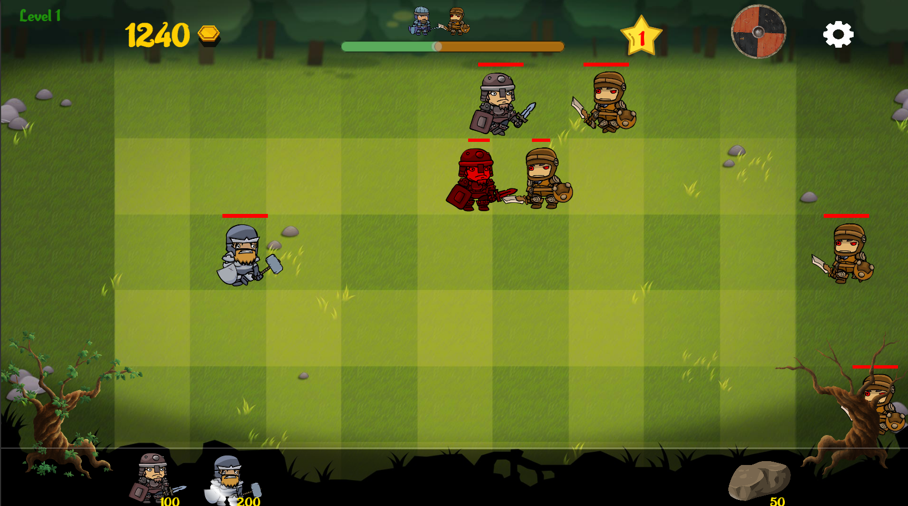
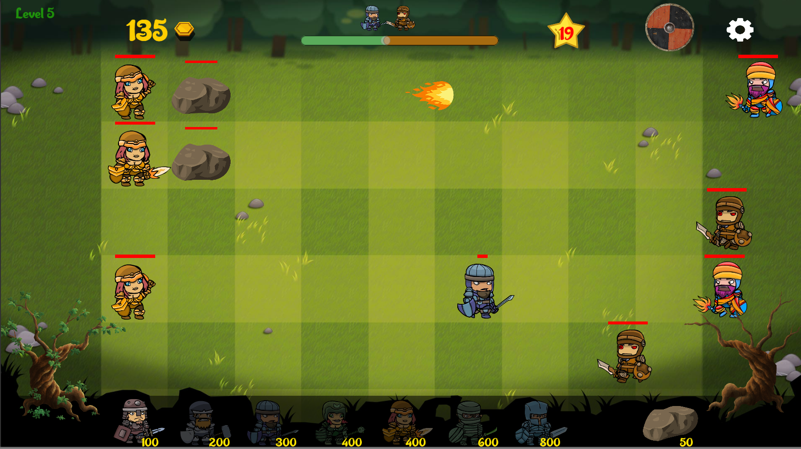

# TimeWars

2D Game with Unity

My first game project, started as a school project, using skills learned from an Udemy course. Significant changes have been made to the original design.

&nbsp;&nbsp;&nbsp;

The goal of the game is to defend your side by collecting coins and defeating enemies, using characters, before they reach the left side of the map. The game has 10 levels with increasing difficulty. 

It was created as a school project and is not available on the Google Play Store at present.

## Getting Started :traffic_light:

This project requires [Unity3D](https://unity.com/ "Unity home") (2019.2.0+) to build and run. Clone this repository and open the root folder in Unity.

## Credits :clipboard:

Thank you for the big effort of [Rick](https://www.youtube.com/rickdavidsonchannel "Youtube of Rick") and platform assisting [GameDev.tv](https://www.gamedev.tv/ "GameDev.tv")
